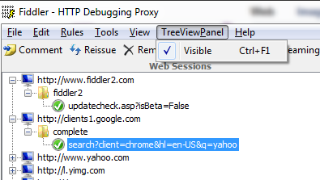
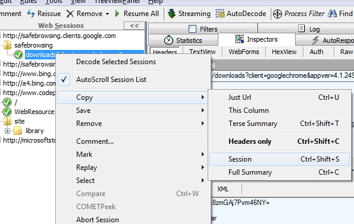
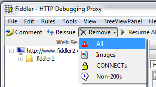

# **CodePlex is shutting down!**

<
As you may already know, after all these amazing years CodePlex is going to stop working, so I've decided to move the binaries over to [my blog](http://blog.gamosoft.com/) to be downloaded from now on. Please use [this direct link to the project](http://blog.gamosoft.com/fiddler-treeview-panel-extension/) to update your bookmarks.
I'll probably put the code elsewhere but for the moment my blog is where you can keep updated of what's going on with the project (or ask questions, etc...). The project will still remain in Codeplex until the site is closed but will no longer be updated.

Thanks for these years CodePlex!!!

**Project Description**
Extension for Fiddler, to display the session information in a TreeView panel instead of the default ListBox, so it groups the information logically...

**Introduction**
If you need to capture http traffic there are several tools out there that can help you with this task, and a really good one is [Fiddler](http://www.fiddler2.com).
It's really flexible and, best of all, it's free. :-)

The only thing you might be a little bit annoyed with is that, when analyzing a site that performs lots of calls, you might end up with a screen like the following:

which is a great amount of information but it's a bit complicated to locate exactly the session you're looking for (sure, you can sort the ListView and such, but that wasn't _fast enough_ for me. :-D).

So, to address this issue I have created an extension that displays all the sessions in a TreeView, so the hosts, folders and calls are organized in a tree structure, much faster to locate what you want and to collapse entire sections of data you don't need. The results for the same captured data can be seen in the next screenshot:

To switch between the two views, a new menu entry has been created in the top level menu called _TreeViewPanel_ where you can activate or deactivate it (shortcut **CTRL** + **F1**):

Integration with Fiddler is not 100%, since I first created this extension to be able to locate sessions in a more efficient manner. You can right-click on a session and the original Fiddler context will show up, although some options will not be usable or have any meaning. I'm sure other stuff might not work as well, but again my goal was just to make it _usable enough_ for my own needs. ;-)

For instance coloring a session will in fact color it in the ListView, but nothing will happen in the tree.
We can however reissue sessions, save them, etc...

**Installation**
In order to install this extension you'll need to copy the compiled assembly .DLL into your _\My Documents\Fiddler2\Scripts_ folder (or _\Program Files\Fiddler2\Scripts_ to make it available to all users on the machine). After that, you'll need to restart Fiddler if was already running.

**Known issues**
Right now, there are issues in the way sessions are deleted, because the only way to effectively delete a session is by choosing the **ALL** option from the tools menu as shown in the selected screenshot:

All the other ways to delete sessions (even from the context menu) will wipe them out from the ListView but +not+ from the TreeView, so you might get out of sync (not a huge deal since you can re-sync by using the above option as well). The biggest roadblock is that the ListView won't fire an event when items are removed from it, so I'd need to implement an additional mechanism to fix it (btw, that's the reason there are some work-in-progress sections in the source code).

But other than that the extension is fully usable and I thought some of you might find it useful too.
Of course, you're free to download the code and if you want to extend it further or have some ideas let me know. :-)

Thanks to Eric Lawrence for some suggestions, I've added double-click to expand/collapse all child nodes at once (where clicked) and to keep the selected session when losing focus off the TreeView.

Kind regards.

**Other projects**
Here are other projects you might be interested in as well:

* [http://outlook2013addin.codeplex.com](http://outlook2013addin.codeplex.com)
* [http://entlibextensions.codeplex.com](http://entlibextensions.codeplex.com)
* [http://slbindabledatagrid.codeplex.com](http://slbindabledatagrid.codeplex.com)
* [http://endomondoexport.codeplex.com](http://endomondoexport.codeplex.com)
* [http://sharepointdocgen.codeplex.com](http://sharepointdocgen.codeplex.com)